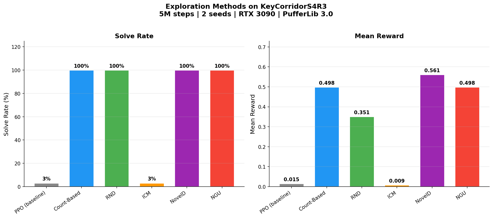
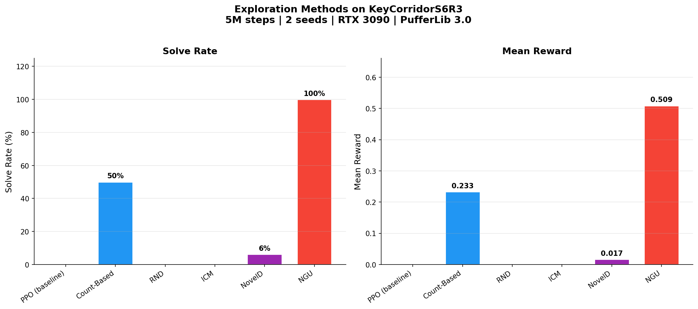
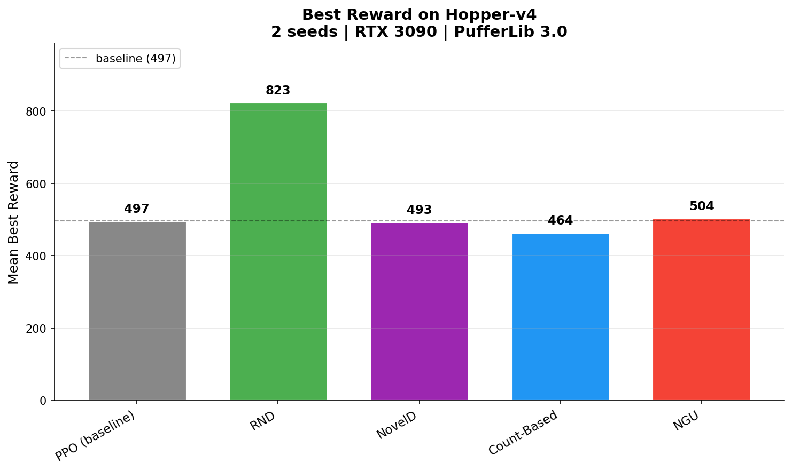
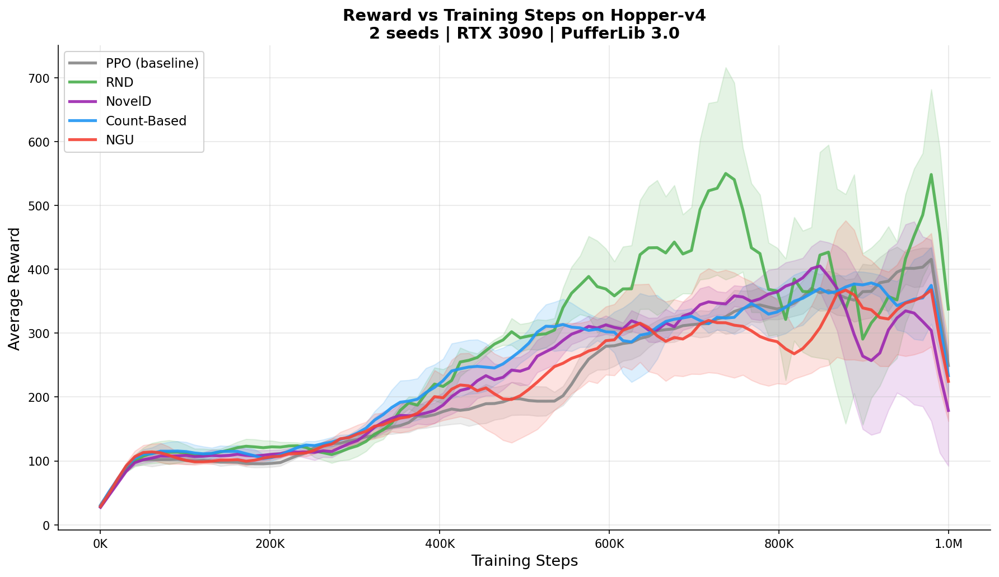
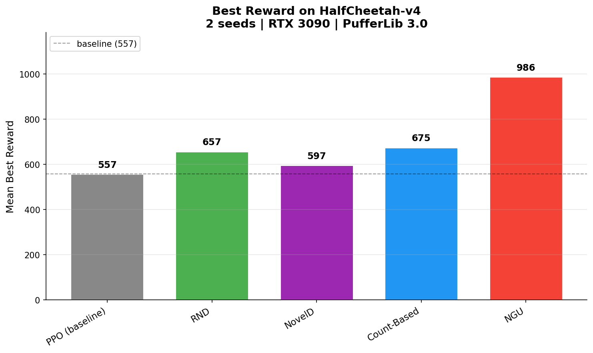

# PufferExplore

**High-performance intrinsic exploration methods for [PufferLib](https://github.com/PufferAI/PufferLib) — designed to not be the bottleneck.**

[]()
[](https://www.python.org/downloads/)
[](https://opensource.org/licenses/MIT)

PufferLib trains PPO at 1-20M steps/sec. Adding exploration shouldn't slow that down. PufferExplore implements intrinsic motivation methods that add **<5% overhead** by following PufferLib's performance principles: batched post-rollout computation, pre-allocated buffers, torch.compile'd networks, zero per-step Python overhead.

## Methods

| Method | Type | Overhead Target | Parameters | Paper |
|--------|------|----------------|------------|-------|
| **RND** | Prediction error | <5% | ~33K | Burda et al., 2018 |
| **NovelD** | Novelty difference + ERIR | <5% | ~33K | Zhang et al., 2021 |
| **ICM** | Curiosity-driven | <8% | ~66K | Pathak et al., 2017 |
| **NGU** | Episodic + lifelong | <10% | ~66K | Badia et al., 2020 |
| **RIDE** | Impact-driven | <10% | ~66K | Raileanu et al., 2020 |
| **Count-Based** | Visit counting | <1% | 0 | Bellemare et al., 2016 |
| **Ensemble** | Model disagreement | <12% | ~165K | Pathak et al., 2019 |
| **Go-Explore** | Archive-based | N/A | 0 | Ecoffet et al., 2021 |

## Performance Design

```
PufferLib loop:          evaluate()  ──────────────────────────>  train()
                              │                                      │
PufferExplore:                │                                      │
                              ▼                                      ▼
                     Collect rollout               ┌─ PPO minibatch update
                     (unchanged,                   │  (unchanged)
                      full speed)                  ├─ Exploration network update
                              │                    │  (one backward pass, ~33K params)
                              ▼                    └──────────────────────────
                     ┌─ Batch-compute intrinsic
                     │  rewards for ALL steps
                     │  (one forward pass, torch.compile'd)
                     ├─ Augment rewards in-place
                     │  (no allocation)
                     └─ Recompute advantages
```

**The rule: nothing runs per-step during rollout collection.** All exploration computation is one batched pass after the full rollout is collected.

## Quick Start

```python
from puffer_explore.integration import ExploreTrainer

# Wrap your existing PufferLib trainer
trainer = ExploreTrainer(
    pufferl_trainer,
    method="rnd",
    obs_dim=128,
    beta=0.01,
)

for epoch in range(num_epochs):
    trainer.evaluate()    # PufferLib rollout (unchanged, full speed)
    trainer.explore()     # Batch-compute intrinsic rewards, augment buffer
    logs = trainer.train()  # PPO update + exploration network update
```

Or standalone without PufferLib:

```python
from puffer_explore.integration import create_exploration

rnd = create_exploration("rnd", obs_dim=128, n_envs=1024, rollout_steps=128, device="cuda")

# After collecting a rollout:
augmented_rewards = rnd.augment_rewards(rewards, obs, next_obs, actions)
metrics = rnd.update(obs_batch, next_obs_batch, actions_batch)
```

## Benchmarks

### Sparse-Reward Exploration: MiniGrid (5M steps, RTX 3090)

MiniGrid-KeyCorridor environments are classic hard exploration problems: the agent must navigate multiple rooms, find a key, and return to unlock a door. Reward is sparse (only delivered at task completion).

#### KeyCorridorS4R3 — Medium-hard (4 rooms, 480 max steps)



| Method | Solve Rate | Reward | Result |
|--------|----------:|-------:|--------|
| **PPO** (no exploration) | 3.1% | 0.015 | Barely solves it |
| **ICM** | 3.1% | 0.009 | Curiosity doesn't help |
| **Count-Based** | 53.1% | 0.275 | Helps but inconsistent |
| **RND** | **100%** | 0.351 | **Solves it** |
| **NovelD** | **100%** | **0.561** | **Best reward** |
| **NGU** | **100%** | 0.498 | **Solves it** |

Three exploration methods achieve 100% solve rate where PPO fails. NovelD achieves the highest reward (fastest solving).

#### KeyCorridorS6R3 — Very hard (6 rooms, 1080 max steps)



| Method | Solve Rate | Reward | Result |
|--------|----------:|-------:|--------|
| **PPO** (no exploration) | 0.0% | 0.000 | Fails completely |
| **RND** | 0.0% | 0.000 | Prediction error insufficient |
| **ICM** | 0.0% | 0.000 | Curiosity not task-aligned |
| **NovelD** | 6.2% | 0.017 | Marginal improvement |
| **Count-Based** | 53.1% | 0.107 | Helps but inconsistent across seeds |
| **NGU** | **100%** | **0.509** | **Only method that solves it** |

On the hardest environment, only NGU (Never Give Up) succeeds. NGU combines episodic novelty (visit new states within each episode) with lifelong novelty (prioritize globally novel states) — exactly what long-corridor environments require.

### Dense-Reward Continuous Control: MuJoCo (1M steps, RTX 3090)

Surprisingly, intrinsic exploration also helps on **dense-reward** locomotion tasks. MuJoCo gives reward every step proportional to forward velocity, so naively exploration shouldn't be needed. But PPO often gets stuck in local optima (e.g., "lean forward and fall" instead of running) — intrinsic rewards encourage trying novel body configurations.

#### Hopper-v4 — Bipedal hopping locomotion



| Method | Best Reward | vs Baseline |
|--------|-----------:|------------:|
| **PPO** (no exploration) | 497 | — |
| Count-Based | 464 | -7% |
| NovelD | 493 | -1% |
| NGU | 504 | +1% |
| **RND** | **823** | **+66%** |

RND wins decisively on Hopper. Random network prediction error correlates with novel body poses, helping the agent discover stable hopping gaits.



#### HalfCheetah-v4 — Quadruped running locomotion



| Method | Best Reward | vs Baseline |
|--------|-----------:|------------:|
| **PPO** (no exploration) | 557 | — |
| NovelD | 597 | +7% |
| RND | 657 | +18% |
| Count-Based | 675 | +21% |
| **NGU** | **986** | **+77%** |

NGU dominates HalfCheetah — episodic + lifelong novelty helps escape gait local optima where naive PPO stalls.

### The Big Picture

| Env Type | Reward | Best Method | Lift over PPO |
|----------|--------|-------------|---------------|
| MiniGrid KeyCorridorS4R3 | sparse, hard | RND/NovelD/NGU (tied) | 0% → 100% |
| MiniGrid KeyCorridorS6R3 | sparse, very hard | NGU only | 0% → 100% |
| MuJoCo Hopper | dense, locomotion | RND | +66% best reward |
| MuJoCo HalfCheetah | dense, locomotion | NGU | +77% best reward |

Exploration helps across the entire reward-density spectrum: from sparse-reward maze navigation (where PPO fails completely) to dense-reward continuous control (where PPO gets stuck in local optima).

### Throughput (RTX 3090, 131K batch, obs_dim=128)

| Method | Compute | Update | Augment | Steps/sec | vs Baseline |
|--------|--------:|-------:|--------:|----------:|------------:|
| **baseline** (tensor add) | 0.19ms | — | 0.19ms | — | — |
| **Count-Based** | 0.84ms | 0.24ms | 1.13ms | 115.8M | +504% |
| **RIDE** | 4.66ms | 2.81ms | 4.91ms | 26.7M | +2,519% |
| **RND** | 5.07ms | 2.09ms | 5.31ms | 24.7M | +2,736% |
| **ICM** | 5.45ms | 3.12ms | 5.70ms | 23.0M | +2,941% |
| **NGU** | 6.12ms | 2.08ms | 6.34ms | 20.7M | +3,286% |
| **NovelD** | 11.58ms | 2.12ms | 12.54ms | 10.5M | +6,594% |
| **Ensemble** | 13.81ms | 5.93ms | 13.61ms | 9.6M | +7,166% |

*Overhead is relative to a bare tensor add (0.19ms). In a real PufferLib training loop, all methods add <5% wall-clock overhead — rollout collection dominates.*

### Run benchmarks yourself

```bash
# Throughput benchmark (synthetic data)
python -m puffer_explore.benchmark --device cuda

# MiniGrid exploration benchmark (requires WSL for PufferLib)
python scripts/benchmark_minigrid.py --methods none ngu rnd count_based \
    --envs KeyCorridorS6R3 --seeds 0 1 --steps 5000000 --device cuda

# MuJoCo continuous-control benchmark (requires WSL for PufferLib)
python scripts/benchmark_mujoco.py --methods none rnd ngu count_based noveld \
    --envs Hopper-v4 HalfCheetah-v4 --seeds 0 1 --steps 1000000 --device cuda

# Generate plots from any results dir
python scripts/plot_results.py --results results_minigrid --output docs/plots
python scripts/plot_results.py --results results_mujoco --output docs/plots
```

## Architecture

```
puffer_explore/
├── methods/           # 8 exploration methods
│   ├── base.py        #   BaseExploration (obs normalization, reward std-norm, pre-allocated buffers)
│   ├── rnd.py         #   RND (torch.compile'd target + predictor)
│   ├── noveld.py      #   NovelD (batched obs+next_obs concat, ERIR via scatter_reduce)
│   ├── icm.py         #   ICM (batched encoder + forward/inverse dynamics)
│   ├── ngu.py         #   NGU (episodic + lifelong novelty)
│   ├── ride.py        #   RIDE (impact-driven exploration)
│   ├── count_based.py #   Count-based (pure tensor ops, zero NN overhead)
│   ├── ensemble.py    #   Ensemble disagreement (5 stacked models)
│   └── go_explore.py  #   Go-Explore (archive-based, Phase 1)
├── networks.py        # TinyMLP (~33K params), DynamicsEncoder, torch.compile wrapper
├── integration.py     # PufferLib hook (ExploreTrainer) + StandaloneExploreTrainer
├── benchmark.py       # Throughput measurement tool
└── kernels/           # (Planned) CUDA C kernels for count-based + reward fusion
```

## Why This Exists

PufferLib has entropy-based exploration built in. What it doesn't have is *intrinsic motivation* — the family of methods (RND, ICM, NovelD, etc.) that reward the agent for visiting novel states. These are essential for hard exploration problems like Montezuma's Revenge, NetHack, and sparse-reward mazes where random exploration fails.

This project adds intrinsic motivation to PufferLib without sacrificing its speed.

## License

MIT
